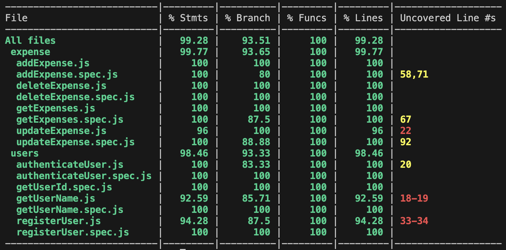

# Control cost

## Intro
It is an web/app that in its first version, will make a cost control in principle for the hospitality industry, the idea is to be able to put the prices of delivery notes or invoices and to provide you with a monthly control.

![]logo proyecto.jpeg

## Functional

### Use Cases

First version

Restaurant (user)
- manage employee.
- update password.
- add expense
- remove expense
- add supplier (proveedor)
- remove supplier

Employee (user)
- update password.
- add expense
- remove expense
- add supplier (proveedor)
- remove supplier

Second version

Admin (user)
- manage restaurants

Restaurant (user)
- admin general expense
- remove expense
- add bill photo

Employee (user)
chef
- add expense of cook
- add suplier of cook

waiter
- add expense of restaurant
- add suplier of restaurant.

### UXUI Design
[Figma]https://www.figma.com/design/2hMcMHscn6ZNAiL4X0L8lG/Untitled?node-id=0-1&node-type=canvas&t=J6ES7ZypCmO65O1d-0

## Technical

### Bloks

- App (the client-side application)
- API (the server-side API)
- DB (the database)

### Packages

- doc (the documentation)
- app (the client-side application)
- api (the server-side API)
- dat (the data model and driver)
- com (the common validations, utils, ...)

### Techs

- HTML/CSS/JS (...)
- React (...)
- Node (...)
- Express (...)
- Mongo (...)
- Mocha & Chai (...)
- [...]

### Data Model

#### User
- id (UUID)
- name (string)
- email (string)
- password (string)
- role (string, enum: admin | restaurant | employee)
- date (date)
- license (string)

#### Expense
- id (UUID)
- author (User.id)
- supplier (Supplier.id)
- amount (number)
- images ([string])
- date (date)

#### Supplier
- id (UUID)
- name (string)
- email (string)
- contact (string)
- address (string)
- phone (string)
- date (date)

### Test Coverage 

