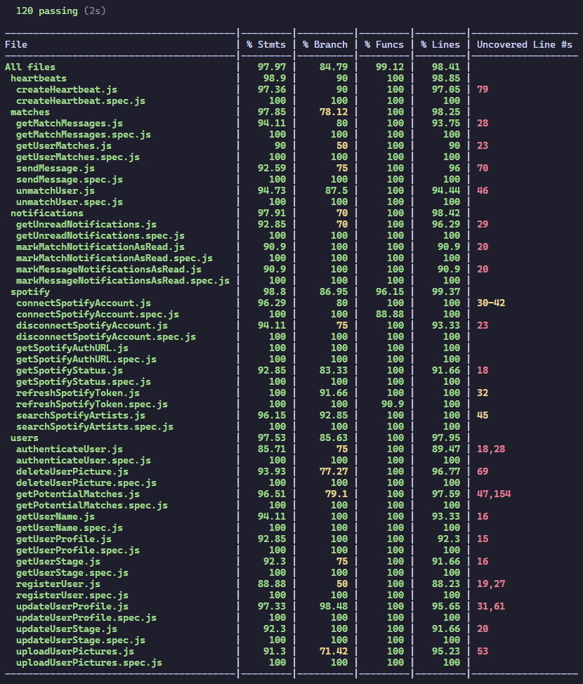

# Heartbeat

## Intro

If music is your world and you're seeking others who resonate with your taste, Heartbeat is the ultimate app for bringing music lovers together for friendship or perhaps something deeper.

## Functional

### Use Cases

- edit own profile
- link Spotify account
- view other profiles
- filter profiles based on favourite artists, age, distance
- swipe left/right on someone
- chat with people you match with
- get notifications

### UXUI Design

[Figma](https://figma.com)

## Technical

### Blocks

- App (client-side application)
- API (server-side API)
- DB (database)

### Packages

- doc (documentation)
- app (client-side application)
- api (server-side API)
- dat (data model and driver)
- com (common validations)

### Techs

- HTML/CSS/JS
- React
- Node
- Express
- Mongo
- Mongoose
- Tailwind
- Mocha & Chai
- Socket.IO
- Sinon

### Data Model

User
- id (ObjectId)
- name (string)
- email (string, unique)
- password (string, hashed)
- dateOfBirth (Date)
- gender (string, enum: Man | Woman | Nonbinary)
- targetGender ([string], enum: Men | Women | Nonbinary people)
- coordinates (GeoJSON Point: { type: 'Point', coordinates: [longitude, latitude] })
- bio (string, optional)
- pictures ([string])
- profilePicture (string)
- minAge (number, default: 18, range: 18-54)
- maxAge (number, default: 55, range: 19-55)
- distance (number, default: 100)
- artists ([{ id: string, name: string }])
- spotifyId (string, optional, unique)
- spotifyAccessToken (string, optional)
- spotifyRefreshToken (string, optional)
stage (string, enum: name-dob | gender | artists | completed, default: name-dob)

Heartbeat
- id (ObjectId)
- sender (User.id)
- receiver (User.id)
- action (string, enum: left | right)
- date (Date, default: now)

Match
- id (ObjectId)
- users ([User.id])
- messages ([Message])
- createdAt (Date, default: now)
- lastActivity (Date, default: now)

Message
- id (ObjectId)
- sender (User.id)
- text (string)
- timestamp (Date, default: now)

Notification
- id (ObjectId)
- from (User.id)
- to (User.id)
- type (string, enum: match | message)
- date (Date, default: now)
- read (boolean, default: false)
- matchId (Match.id, optional)

### Test Coverage

