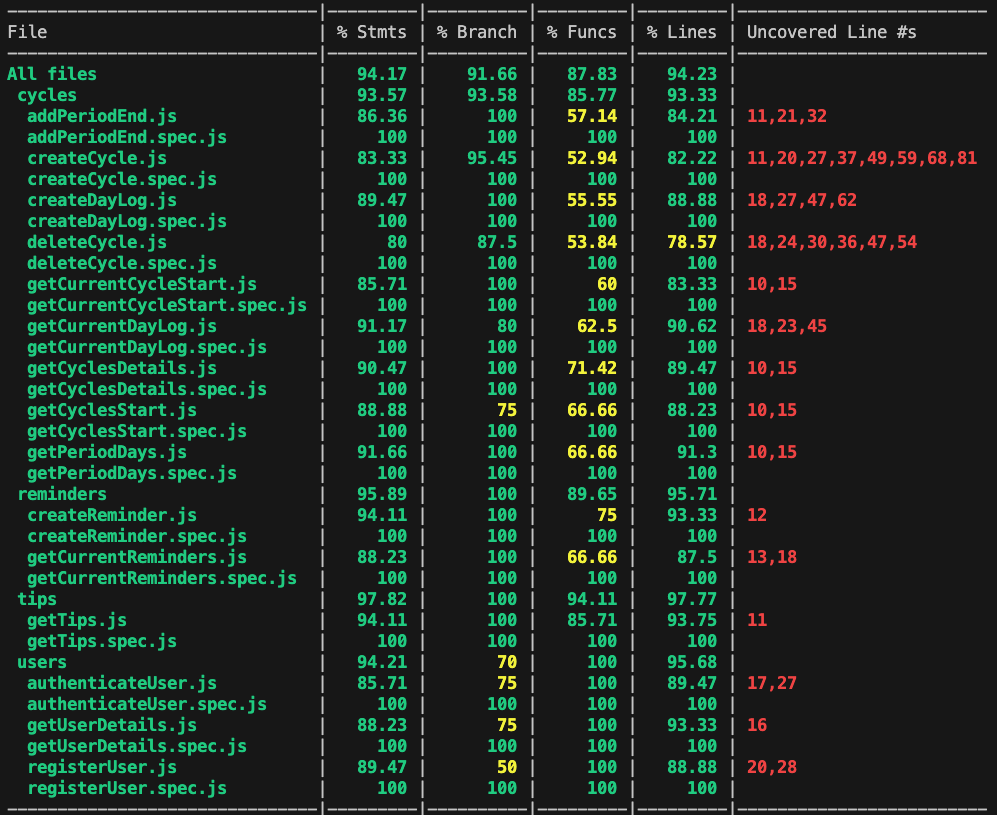

# Period (Syncly pa los amigos)

## Intro

This app is designed for menstruating people to be your **everyday companion** to stay organized and in control.

Whether you want to **keep track of symptoms**, set **reminders** for important dates, or discover **tips** for each phase of your cycle, Period adapts to your needs and helps you **sync with your body**.

It’s more than just tracking—it’s about **embracing your rhythm** and thriving every day of the month.

## Functional

### Use Cases

User
- create/update/delete period start and end dates to calendar
- create/update a log of daily symptoms and activities
- create & read reminders
- read data about your current cycle
- read reports of the last cycles    
- read tips regarding your week of the cycle

### UXUI Design

[Figma](https://www.figma.com/design/0axquRKAMeYzYictpTqeQX/Period?node-id=0-1&t=9KYWTC76WtFOT8jc-1)

## Technical

### Blocks

- App (client-side application)
- API (server-side API)
- DB (database)

### Packages

- doc (documentation)
- app (client-side application)
- api (server-side API)
- dat (data model and driver)
- com (common validations, utils, ...)

### Data Model

User
- id (ObjectId)
- name (string)
- email (string, unique)
- password (hashed string)

Cycle
- id (ObjectId)
- user (User.id)
- start (Date)
- end (Date, optional)
- periodEnd (Date)
- dayLogs ([DayLog])

DayLog
- id (ObjectId)
- date (Date)
- symptoms (string, enum: fatigue | headache | cramps | tender breasts | acne | backache | cravings | abdominal pain | dryness)
- mood (string, enum: calm | energetic | happy | mood swings | sad | apathetic | anxious)
- flow (string, enum: no discharge | creamy | watery)
- sleep (string, enum: poor | average | good)
- sexualActivity (string, enum: no sex | sex)
- sexualEnergy (string, enum: low | moderate | high)

Reminder
- id (ObjectId)
- user (User.id)
- date (Date)
- title (string)

Tip
- id (ObjectId) 
- date (Date)
- phase (string, enum: menstruation | follicular | ovulation | luteal)
- category (string, enum: nutrition | exercise | self-care | music)
- description (string)

### Techs

- HTML/CSS/Tailwind/JS (structure, style, and interactivity of web pages)
- React (build dynamic user interfaces with reusable components)
- Node (JavaScript runtime for server-side applications)
- Express (minimal web framework for Node to build APIs)
- Mongo (database for flexible, document-based storage)
- Mocha & Chai (testing framework for JavaScript)
- jsonwebtoken (jwt)
- bcrypt

### Test Coverage

El código está cubierto

