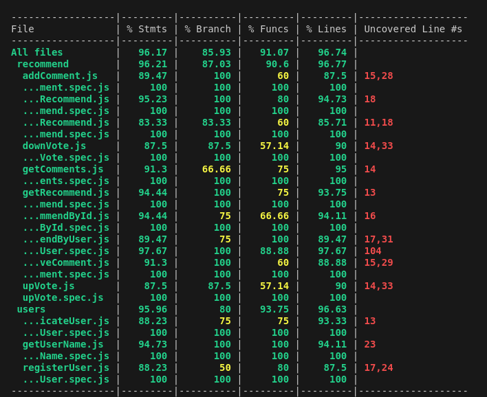

# [miRed]

## Intro

miRed is a social media network focused on creating an information network for individuals moving abroad. If you are already on ground share your own experiences and reviews with your fellow diaspora.

#### Move with confidence

## Functional

### Use Cases

User

- create posts
- view posts
- toggole like posts
- add commment
- view comments
- remove comments
- add review
- remove review
- profile page
- toggle posts / reviews

Admin

- view reports (future)
- delete user (future)
- delete recomendation 
- remove comment (future)
- [...]

### UXUI Design

[Figma] (https://www.figma.com/proto/3IrAr9aFkVc10tHArfxG2g/App?node-id=0-1&t=8uDxRWgt43JHPKKw-1)

## Techinal Aspects

### Blocks

- App (client-side application)
- API (server-side application)
- DB (the database)

### Packages

- doc ( documentation)
- app (client-side application)
- api (server-side API)
- dat (data model and driver)
- com (common validation, utils, ...)

### Data Model

User

- id (UUID)
- role (user || admin)
- name (string)
- email (string)
- username (string)
- password (string)
- date of birth (string)
- trust rating (number)
- point level (number)

Recommendation (mongo)

- id (UUID)
- comments ([Comment])
- author (User.id)
- city (string)
- country (string)
- category (number, enum: 1 (paperwork) | 2 (utilities) | 3 (food) | 4 (events) | 5 (healthcare) | 6 (neighbourhoods) | 7 (accommodations) | 8 (transport) ) //consider using numbers?
- price (number, enum: 1(€) | 2(€€) | 3(€€€))
- link (string) // url || google map
- text (string)
- date (Date)
- upVotes ([User.id])//not visible
- downVotes ([User.id])//not visible
- image (string)
- city (string)
- country (string)

Comment

- id (UUID)
- author (User.id)
- text (string)
- date (Date)

Country (future use)
- name (string)

City (future use)
- name (string)
- country.id

Destination (future use)
- name (string)

### Techs

- HTML/CSS/JS (...)
- React (...) 
- Node (...)
- Express (...)
- Mongo (...)
- Mocha & Chai (...)
- [...]

### Test Coverage

- Mocha & Chai
-

### TODO List
- https://github.com/b00tc4mp/isdi-bootcamp-202409/issues/230