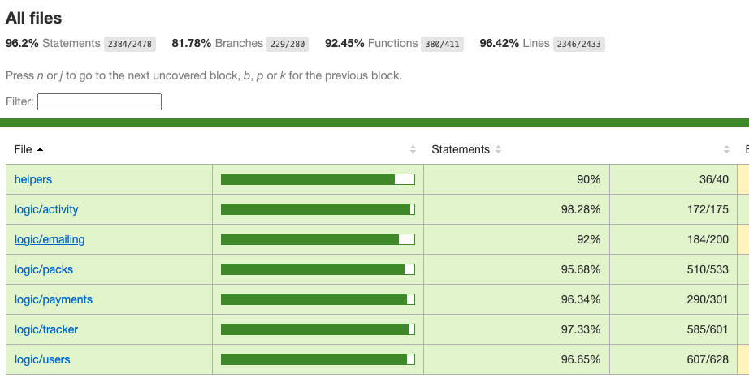

# Hourify - Time tracker

## Intro


This project develops an application focused on time management or "session units" for anyone who may sell or buy services that involve time or sessions from another person. Ideally, it is designed for freelancers, although it is extendable to practically the entire population.

When a service provider works with many clients simultaneously, and each of them contracts a variable number of hours/sessions, management can become complicated. This forces professionals to create complex Excel spreadsheets to keep track of their progress with each client.

### 🏁 Main goal
Say goodbye to those old Excel spreadsheets! The main goal of this application is to improve time and session management for professionals working with services. It allows them to optimize their workflow and not worry about tracking sessions.

For example, a freelancer who sells programming, web design, illustration, or writing hours can manage hour packs, assign them to clients, and accurately track the time spent on each one.

On the other hand, a psychologist who sells 45-minute sessions can also use the application to manage session units instead of time units, improving usability and simplifying the workflow.

The application will visually and simply display a client's status, whether they have paid, check available hours or sessions, track consumed time, and send automatic email notifications to the client when necessary.

The client, in turn, will be able to view the status of their purchased hour packs, track the time consumed by the freelancer, and see how the time has been spent. They will also receive notifications after purchasing a pack or when they have few hours left, so they can decide whether to acquire more time.

The client can also communicate through the application with the freelancer managing their pack to resolve doubts or discuss anything related to their time.

### Target Audience
This program can be used by people such as:

- Web designers and programmers


- Psychologists and coaches, 

- Doctors and healthcare professionals, 


- Painters, illustrators, and photographers, 

- Managers, consultants, auditors,

- Maintenance or cleaning personnel,


- And, in general, anyone who may sell services by hours or sessions.


## Functional

### Use Cases

#### User

##### Provider Functions v.0

- Client management (CRUD)
- Pack management (CRUD)
- Assigning packs to clients
- Creating "fake" users (to assign a pack if the client user does not yet exist on the platform) v.1
- While the "client" user does not exist, the provider user can modify their personal data.
- Manage pack time (increase, decrease, via timer)
- Manage pack units (increase, decrease)
- Sending automatic notifications to the client.


##### Customer Functions v.1

- View/modify personal data
- Check the status of purchased hour packs
- View payment status
- View consumed/available time or units
- View activity history
- Messaging with other platform users


### UXUI Design

[View Figma style concept](https://www.figma.com/design/R8xuqhFCQSCcYK1hLr1JAe/Hourly-App?node-id=0-1&t=urwXOUrypTYpI8Su-1)


[Excalidraw flow diagram](https://excalidraw.com/#json=pzlsR_lWNxrFnqqh7yWZo,JqVFq0iAhVjORED9xtnj6g) 


## Technical

### Blocks

- App (the client-side application)
- API (the server-side API)
- DAT (the database, mongoose, and datamodel)
- COM (common files such errors and validations)

### Packages

- doc (the documentation)
- app (the client-side application)
- api (the server-side API)
- dat (the data model and driver)
- com (the common validations, utils, ...)

### Techs

- HTML/CSS/JS
- React (Maquetación de los componentes y la estructura de la aplicación)
- Node.js (Responsable del funcionamiento de todas las lógicas del back)
- Express (API para la interacción con el back)
- Mongo (Base de datos)
- Mocha & Chai (Para el testing)
- NodeMailer.js (Para el envío de notificaciones email automáticas)
- Tailwindcss

### Data Model

User
- id (UUID)
- username (string)   
- password (string)   
- email (string)
- plan (string, enum: free | pro) 
- planExpiryDate (Date) 
- role ([string, enum: standard | provider]) 
- dni (string) 
- name (string)
- surname1 (string)
- surname2 (string)
- biography (string)
- country (string)
- province (string)
- city (string)
- postalCode (string)
- address1 (string)
- address2 (string)
- number (num)
- flat (num)
- legalName (string)
- website (string)
- CreationStatus (string, enum: true | false | confirm account)
- customers ([User.id])
- ownPacks ([Pack.id])
- adquiredPacks ([Pack.id])

BasePack
- id (UUID)
- user (User.id)
- packName (string)
- description (string)
- quantity (num)
- unit (string, enum: hours | units)
- expiringTime (num, enum: 1 to 12months (-1 = infinite))
- price (num)
- currency (string, enum: EUR | USD, default: EUR)
- vat (num)
- priceWithVat (num)

Pack
- id (UUID)
- refPack (UUID)
- provider (UUID)
- customer (UUID)
- description (string) max 255
- timerActivated (Date)
- descriptionActivityTemp (string)
- originalQantity (num)
- remainingQantity (num)
- unit (string, enum: hours | units)
- price (num)
- currency (string, enum: EUR | USD, default: EUR)
- purchaseDate (date)
- expiryDate (date, enum: Date | Null)
- status (string, enum: Pending | Active | Expired | Finnished)


Activity
- id (UUID)
- Pack (Pack.id)
- date (date)
- description (string)
- operation (string, enum: add | substract)
- quantity (num)
- remainingQuantity (num)


Payment
- id (UUID)
- Pack(Pack.id)
- amount (num)
- currency (string, enum: EUR | USD, default: EUR)
- date (date)
- method (string, enum: card | bankTransfer | paypal | stripe | cash | bizum | others)
- status (string, enum: pending | completed | canceled | refunded) DELETE
- reference (string)

### Test Coverage



```sh
-----------------------------------|---------|----------|---------|---------|-------------------
File                               | % Stmts | % Branch | % Funcs | % Lines | Uncovered Line #s 
-----------------------------------|---------|----------|---------|---------|-------------------
All files                          |    96.2 |    81.78 |   92.45 |   96.42 |                   
 helpers                           |      90 |    66.66 |     100 |      90 |                   
  getDecimalToTimeFormat.js        |      90 |      100 |     100 |      90 | 21                
  getElapsedTime.js                |     100 |      100 |     100 |     100 |                   
  getTimeFormatToDecimal.js        |   81.25 |    66.66 |     100 |   81.25 | 10,16,28          
  index.js                         |     100 |      100 |     100 |     100 |                   
 logic/activity                    |   98.28 |      100 |     100 |   98.25 |                   
  getActivityByPackId.js           |   88.88 |      100 |     100 |    87.5 | 16,24,32          
  getActivityByPackId.spec.js      |     100 |      100 |     100 |     100 |                   
 logic/emailing                    |      92 |       60 |   87.17 |      92 |                   
  emailExpirationWarning.js        |   86.66 |      100 |   66.66 |   86.66 | 29-30             
  emailExpirationWarning.spec.js   |     100 |      100 |     100 |     100 |                   
  emailFinishedPack.js             |   85.71 |      100 |   66.66 |   85.71 | 28-29             
  emailFinishedPack.spec.js        |     100 |      100 |     100 |     100 |                   
  emailLowTimeWarning.js           |   81.81 |       50 |   66.66 |   81.81 | 17-20,45-46       
  emailLowTimeWarning.spec.js      |     100 |      100 |     100 |     100 |                   
  emailNearExpiryTime.js           |   86.66 |      100 |   66.66 |   86.66 | 29-30             
  emailNearExpiryTime.spec.js      |     100 |      100 |     100 |     100 |                   
  emailRegisterWelcome.js          |   84.61 |      100 |   66.66 |   84.61 | 19-20             
  emailRegisterWelcome.spec.js     |     100 |      100 |     100 |     100 |                   
  index.js                         |     100 |      100 |     100 |     100 |                   
  sendEmail.js                     |      80 |     62.5 |     100 |      80 | 6,30,47-48        
  sendEmail.spec.js                |     100 |      100 |     100 |     100 |                   
 logic/packs                       |   95.68 |    82.81 |   94.28 |   95.84 |                   
  assignPack.js                    |   90.24 |       80 |     100 |   90.24 | 24,39,48,130      
  assignPack.spec.js               |     100 |      100 |     100 |     100 |                   
  checkPackAndUpdate.js            |   86.84 |    76.92 |     100 |   86.84 | 22,34,45,59,77    
  checkPackAndUpdate.spec.js       |     100 |      100 |     100 |     100 |                   
  createBasePack.js                |      90 |      100 |     100 |      90 | 22,32             
  createBasePack.spec.js           |     100 |      100 |     100 |     100 |                   
  deleteBasePack.js                |      80 |     87.5 |   57.14 |   77.77 | 15,28,32,37       
  deleteBasePack.spec.js           |     100 |      100 |     100 |     100 |                   
  getBasePackDetails.js            |     100 |      100 |     100 |     100 |                   
  getBasePackDetails.spec.js       |     100 |      100 |     100 |     100 |                   
  getBasePacks.js                  |      84 |    83.33 |     100 |   86.95 | 15,23,47          
  getBasePacks.spec.js             |     100 |      100 |     100 |     100 |                   
  updateBasePack.js                |    82.6 |    83.33 |   57.14 |    82.6 | 17,24,31,36       
  updateBasePack.spec.js           |     100 |      100 |     100 |     100 |                   
 logic/payments                    |   96.34 |    88.88 |   86.79 |   96.61 |                   
  addPayment.js                    |   81.81 |    66.66 |   57.14 |      85 | 21,28,34          
  addPayment.spec.js               |   97.77 |      100 |     100 |   97.77 | 139               
  deletePayment.js                 |   81.25 |      100 |   57.14 |   78.57 | 11,16,21          
  deletePayment.spec.js            |     100 |      100 |     100 |     100 |                   
  getPayments.js                   |      95 |      100 |   83.33 |   94.44 | 11                
  getPayments.spec.js              |   98.46 |      100 |     100 |   98.46 | 174,239           
 logic/tracker                     |   97.33 |    88.57 |   89.24 |   97.32 |                   
  toggleManualTimeTracker.js       |   88.09 |    88.46 |      70 |    87.8 | 17,39,60,63,70    
  toggleManualTimeTracker.spec.js  |     100 |      100 |     100 |     100 |                   
  toggleManualUnitsTracker.js      |    87.8 |    88.46 |   66.66 |    87.5 | 23,38,58,61,67    
  toggleManualUnitsTracker.spec.js |     100 |      100 |     100 |     100 |                   
  toggleTimeTracker.js             |   88.46 |    88.88 |      60 |   88.46 | 19,23,61,64,68,85 
  toggleTimeTracker.spec.js        |     100 |      100 |     100 |     100 |                   
 logic/users                       |   96.65 |    77.35 |      97 |   97.32 |                   
  authenticateUser.js              |   85.71 |       75 |     100 |   89.47 | 19,28             
  authenticateUser.spec.js         |     100 |      100 |     100 |     100 |                   
  getCustomerPacks.js              |   82.92 |    66.66 |     100 |   85.29 | 15,31,50-51,64    
  getCustomerPacks.spec.js         |     100 |      100 |     100 |     100 |                   
  getCustomers.js                  |   86.95 |    83.33 |     100 |   90.47 | 15,42             
  getCustomers.spec.js             |     100 |      100 |     100 |     100 |                   
  getUserDetails.js                |   93.75 |      100 |      75 |   92.85 | 11                
  getUserDetails.spec.js           |     100 |      100 |     100 |     100 |                   
  getUserName.js                   |   94.11 |      100 |     100 |   93.33 | 20                
  getUserName.spec.js              |     100 |      100 |     100 |     100 |                   
  registerUser.js                  |   90.62 |    96.87 |     100 |   90.32 | 42,77,84          
  registerUser.spec.js             |     100 |      100 |     100 |     100 |                   
  updateUser.js                    |   93.33 |    59.37 |      50 |   93.54 | 30,42             
  updateUser.spec.js               |     100 |      100 |     100 |     100 |                   
-----------------------------------|---------|----------|---------|---------|-------------------
```
