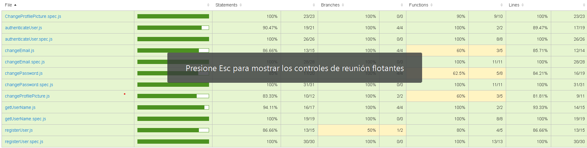
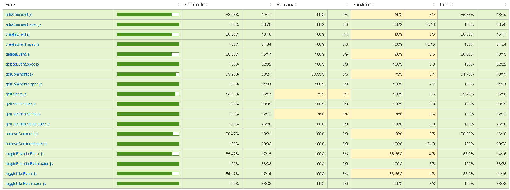

# [DanceTapp!]

## Intro

DanceTapp is an app designed to connect dancers and dance event organizers. Promote your events or search for them according to your preferences.

## Functional

### Brief

- Facilitate interaction between dancers and organizers, creating a community where users can:

- Find nearby dance events.
- Publish your own events (organizers only).
- Like, comment and share events.
- Connect with other dancers.

### Use Cases

Dancer

- Search and explore events with filters by location.
- Give likes to events.
- Comments.
- Share events with friends.
- Add events to favorites.
- Access to a calendar with event scheduling.
- Change password.
- Change e-mail.
- Change photo profile.

Organizer

- Search and explore events with filters by location.
- Give likes to events.
- Comments.
- Share events with friends.
- Add events to favorites
- Access to a calendar with event scheduling.
- Change password.
- Change e-mail.
- Change photo profile.
- Create and manage events.

### UXUI Design

[Figma](https://www.figma.com/proto/0u87rR655ioxblXuFer6mB/Untitled?node-id=0-1&t=uV9czdTHqqmrNzAg-1)

## Technical

### Blocks

- App: The mobile application developed in React.
- API: Backend to manage requests and business logic.
- DB: MongoDB database to store users, events, and roles.

### Packages

- doc (the documentation)
- app (the client-side application)
- api (the server-side API)
- dat (the data model and driver)
- com (the common validations, utils, ...)

### Data Model

User

- id (UUID)
- name (string)
- email (string)
- profile picture (string)
- password (string)
- role (string): Role of the user (dancer | organizer | moderator)
- permission(string, enum: read | write)
- city (string)
- favorites [Event.id]
- createdAt (Date)

Event

- id (UUID)
- author (User.id)
- type (string)
- type (string, enum: Sociales | Escuelas de baile | Clases particulares | Congresos | Masterclases)
- images ([string])
- text (string maxLength 200)
- date (Date)
- location
  - type (string)
  - coordinates ([number])
  - address (string)
  - province (string)
  - likes ([User.id])
- createdAt (Date)

Comment

- id (UUID)
- author (User.id)
- text (string maxLength 200)
- createdAt (Date)

### Techs

- Frontend: React, HTML, CSS, JavaScript, TailwindCSS
- Backend: Node.js + Express
- Database: MongoDB
- Authentication: JWT
- Testing: Mocha & Chai (for backend logic)
- Map Integration: Leaflet.js
- Geocoding: Integration with Nominatim API

### Test Coverage

## Planning

[TO DO List](https://github.com/b00tc4mp/isdi-bootcamp-202409/issues/233)
