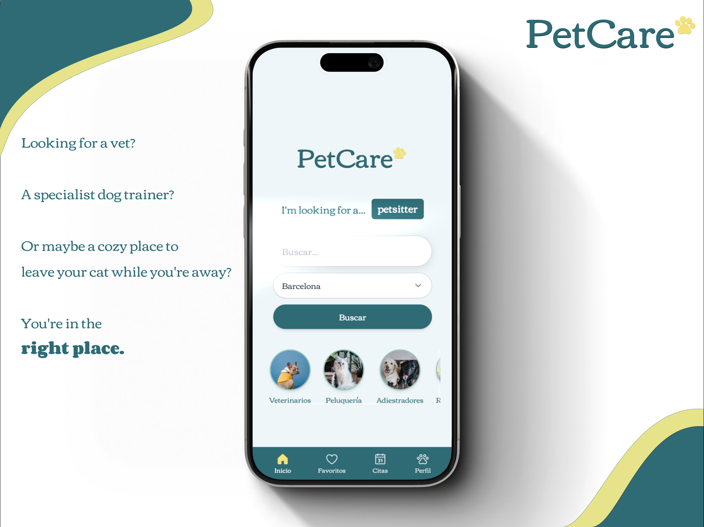

# [PetCare]

## Intro

Welcome to PetCare, your go-to app to discover pet services in your city.

Easily explore veterinary clinics, trainers, groomers, pet sitters, and more — all in just a few taps.

Looking for a vet? A specialist dog trainer? Or maybe a cozy place to leave your cat while you're away? You're in the right place.

PetCare offers a modern, location-based solution to connect pet owners with the best local services.

Why should you use PetCare?

- Convenience: Find nearby services through a simple, intuitive search.
- Transparency: Access essential info about each provider like address, photos, and categories.
- Geolocation: Browse results by city or based on your current location.

What you can do right now (Beta version):

- Use the search bar to explore services by keyword.
- Filter by city or browse providers near your location.
- Discover providers sorted by category: vets, trainers, groomers, pet sitters...
- Click on a provider to see their profile: name, description, address, location and photos.
- Create a user account and manage your profile.
- Check the app in both English and Spanish language.
- Browse a mock section of your past reviews, past payments and past/future appointments.
- Browse the most Frequently Asked Questions from your profile.
- Request account deletion through your profile.

> ⚠️ Features like reviews, favorites, bookings or commenting are planned but not yet available in this version.

## Functional

PetCare is a modern solution for all your pet care needs.

### Use Cases

#### User

- create an account
- log in to your account
- search places
- search trainers
- search pet sitters
- search grooming
- search veterinaries
- search services
- see place profile
- change your email
- change your password
- look for centre contact
- view pets
- view FAQ (Frequently Asked Questions)
- change language english / spanish
- sign out

### UXUI Design

- [Figma](https://figma.com)

## Technical

# Frontend (Client)

- React - Main library used to build the user interface.
- Vite – Development server and build tool for faster frontend performance.
- Tailwind CSS – Utility-first CSS framework for styling and responsiveness.
- Algolia – Real-time search engine used to find centers by name, category or location.
- React Router DOM – To manage navigation and different routes in the app.
- LocalStorage – To store the user authentication token on the client side.

# Backend (Server)

- Node.js – JavaScript runtime environment for building the backend.
- Express.js – Web framework used to create API endpoints and business logic.
- MongoDB – NoSQL database to store users, pets, centers and other app data.
- Mongoose – ODM used to define models and interact with MongoDB.

# Testing

- Mocha & Chai – For testing on the backend.

# Others

- Dotenv – To manage environment variables (e.g., API keys or DB URLs).
- JWT (JSON Web Tokens) – Used for user authentication and session management.
- CORS – To allow communication between frontend and backend.

### Blocks

- Client (client-side application)
- Server (server-side API)
- DB (database)

### Packages

- doc - Documentation and planning
- client - Frontend code (components, pages, styles)
- server - Backend code (routes, controllers, middleware)
- com - Common utilities, helpers, and validations
- tests – Backend test files using Mocha & Chai (/server)

### Data Model

User

- id (UUID)
- role ( string, enum: customer )
- name (string, required)
- email (string, required)
- password (string. required)
- category ( string, enum: vets | trainers | grooming | pet sitters )

### Techs

- HTML/CSS/JS
- React
- Node
- Express
- MongoDB Atlas
- Mocha & Chai
- Algolia
- Tailwind
- Photoshop

### Test Coverage

npm test

> login-test@1.0.0 test
> mocha --timeout 10000

authenticateUser
🟢 [TEST] Connected to database
✔ should log in with valid credentials (120ms)
🔴 [TEST] Disconnected from database

changeUserEmail
🟢 [TEST] Connected to database
✔ debería cambiar el email correctamente si userId y email son válidos (146ms)
✔ should throw NotFoundError if the user does not exist (45ms)
✔ should throw an error if the userId is invalid
✔ should throw an error if the email is invalid
🔴 [TEST] Disconnected from database

changeUserPassword
🟢 [TEST] Connected to database
✔ should change the password if the current one is correct (342ms)
✔ should throw CredentialsError if the current password is incorrect (110ms)
✔ should throw NotFoundError if the user does not exist (41ms)
✔ should throw an error if userId is invalid
✔ should throw an error if oldPassword is invalid (39ms)
✔ should throw an error if newPassword is invalid (39ms)
🔴 [TEST] Disconnected from database

getUserName
🟢 [TEST] Connected to database
✔ should return the name of the targetUser if both IDs are valid (47ms)
✔ should throw NotFoundError if userId does not exist (41ms)
✔ should throw NotFoundError if targetUserId does not exist (40ms)
✔ should throw an error if userId is invalid
✔ should throw an error if targetUserId is invalid
🔴 [TEST] Disconnected from database

registerUser
🟢 [TEST] Connected to database
✔ should register a user successfully with matching passwords (182ms)
✔ should fail if passwords do not match
🔴 [TEST] Disconnected from database

18 passing (6s)

### ROADMAP

V.0
BETA

V.1

- add pet (name, birthdate, species)
- remove pet
- map in explorer
- comment
- see comments from people in centre profiles
- save provider (in favs)
- save trainer (in favs)
- edit pet

V.2

- request to remove a comment
- add pet avatar
- add user avatar
- book appointment as guest
- see provider list as a guest

V.3

Partner side:

- create provider profile
- edit provider profile (mail, phone, description, name, location, social links)
- manage availability of their place and opening hours
- view notifications of new appointments made by customers (pop-up or mail)
- manage their provider photos
- report a comment
- apply to Visibility Program (planned for future)
- manage their own prices of treatments and duration
