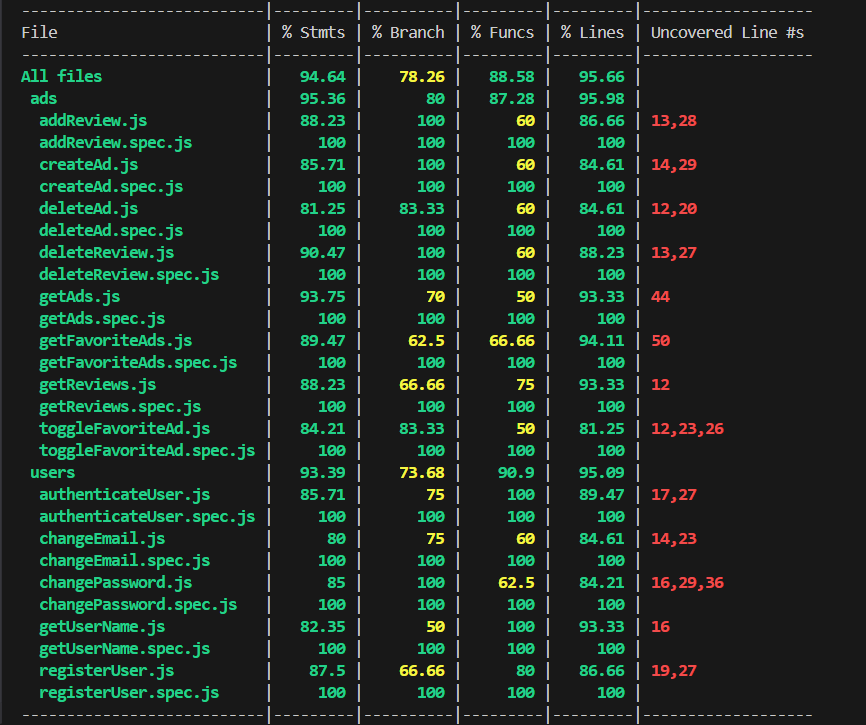

# Loving Hands APP

## Intro

This is a web app for elderly people who need some assistance at home.

## Functional

- The Loving Hands web app is designed to connect caregivers and elders in need of assistance at home.

### Use Cases

Caregiver (User)

- Create and publish help offers.
- Search for help requests.
- Contact an elder.
- Save the post of a specified elder.
- Manage profile: Update profile, view ratings and manage saved posts.
- Rate elders.

Elder (User)

- Create and post help requests.
- Search for assistance offers.
- Contact a Caregiver.
- Save the post of a specified caregiver.
- Manage profile: Update profile, view ratings and manage saved posts.
- Rate caregivers.

### UXUI Design

[Figma](https://www.figma.com/design/vvDGYcAaFPJKgUSgKO6Gkm/LovingHands?node-id=0-1&node-type=canvas&t=QOzUYzlKPp6uLx4E-0)

## Technical

### Blocks

- App (the client-side application)
- API (the server-side API)
- DB (the database)

### Packages

- doc (the documentation)
- app (the client-side application)
- api (the server-side API)
- dat (the data model and driver)
- com (the common validations, utils, ...)

### Techs

- HTML/CSS/JS (...)
- React JS (...)
- Node (...)
- Express (...)
- Mongo (...)
- Mocha & Chai (...)
- [...]

### Data Model

User

- id (uuid)
- name (string)
- email (string)
- telephone (string)
- password (string)
- role (string, enum: caregiver | elder)
- reviews ([Review])
- favorites ([Ad.id])

Ad

- id (uuid)
- author (User.id)
- files ([string])
- location
  - type(string)
  - coordinates ([number])
  - address (string)
- description (string)
- date (Date)
- reviews([Review])

Review

- id (uuid)
- author (User.id)
- rating (number)
- comment (string)
- date (date)

### Test Coverage

### Planning

[TO-DO List](https://github.com/b00tc4mp/isdi-bootcamp-202409/issues/237)
