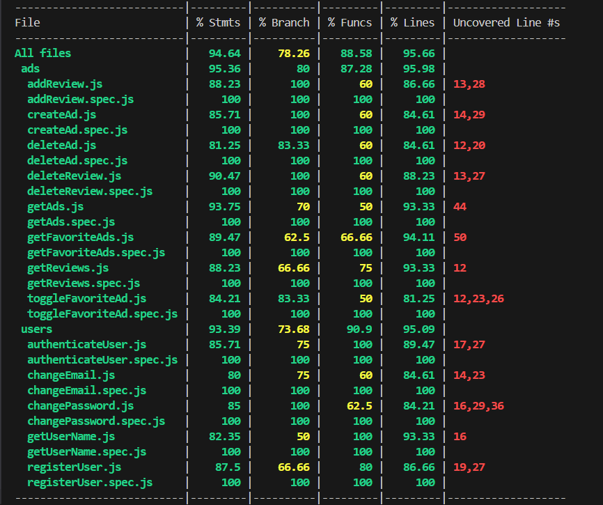

# Loving Hands APP

## Intro

This is a web app for elderly people who need some assistance at home.

## Functional

- The Loving Hands web app is designed to connect caregivers and elders in need of assistance at home.

### Use Cases

Caregiver (User)

- Create and publish help offers.
- Search for help requests.
- Contact an elder.
- Save the ad of a specified elder.
- Manage settings: Update email and password.
- Rate elders.
- View ratings and saved ads.

Elder (User)

- Create and publish help requests.
- Search for assistance offers.
- Contact a Caregiver.
- Save the ad of a specified caregiver.
- Manage settings: Update email and password.
- Rate caregivers.
- View ratings and saved ads.

### UX / UI Design

[Figma](https://www.figma.com/design/vvDGYcAaFPJKgUSgKO6Gkm/LovingHands?node-id=0-1&p=f&t=QVdajI0EGhCizjjL-0)

## Technical

### Blocks

- App (the client-side application)
- API (the server-side API)
- DB (the database)

### Packages

- doc (the documentation)
- app (the client-side application)
- api (the server-side API)
- dat (the data model and driver)
- com (the common validations, utils, ...)

### Techs

- HTML / CSS / JavaScript / Tailwind.
- React JS.
- Vite.
- Node JS / npm.
- Express.
- Mongodb / Mongoose / Compass.
- Mocha & Chai.
- Leaflet / Nominatim API / OpenStreetMap / GoogleMaps API.
- Whatsapp API.
- bcrypt / JWT.

### Data Model

User

- id (uuid)
- name (string)
- email (string)
- telephone (string)
- password (string)
- role (string, enum: caregiver | elder)
- reviews ([Review])
- favorites ([Ad.id])

Ad

- id (uuid)
- author (User.id)
- files ([string])
- location
  - type(string)
  - coordinates ([number])
  - address (string)
- text (string)
- date (Date)
- reviews([Review])

Review

- id (uuid)
- author (User.id)
- calification (number)
- comment (string)
- date (date)

### Test Coverage

### Planning

[TO-DO List](https://github.com/b00tc4mp/isdi-bootcamp-202409/issues/237)
