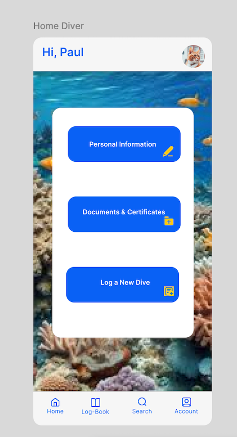

# DIVE & DISCOVER

## Intro

### Dive and Discover App Overview

Dive and Discover is an app designed to connect scuba divers with dive centers worldwide while offering thoughtful insights into local marine life. The app is tailored for two distinct user types: **Divers** and **Dive Centers**, providing features to enhance their diving adventures and operational efficiency.

---

## Key Features

### For Divers  
- A **Home Section** with personalized information, including name, username, email, profile picture, password reset, telephone and equipment size preferences.  
- A **Settings Menu** to update, manage and upload personal details easily.  
- A **Dive Logbook** for recording dive history, including date, location, diving deatils, notes.  
- Access to detailed information about underwater life in specific areas, featuring photos and descriptions of local marine species.

### **For Dive Centers**  
- A dedicated **Home Section** displaying essential details such as the center’s name, address, opening hours, website link, and a photo.  
- A **Settings Menu** to update and manage the dive center’s profile information efficiently.  
- Exclusive **Deals and Offers** for D&D users (coming in v0.3).

### Discover Section

The **Discover Section** is the heart of the app, enabling users to search for dive locations by city or region. Upon selecting a location, users will find:  
1. A **Dive Center List** in the selected area, with detailed profiles to help divers choose and contact their preferred dive center.  
2. A second screen offering educational content about the area’s marine ecosystem. This section features vivid images and descriptions of sea creatures, helping divers familiarize themselves with the local biodiversity before their dive.

---

## Vision

Dive and Discover bridges the gap between scuba diving enthusiasts and dive centers while fostering awareness and appreciation of marine life. Whether you’re an experienced diver or exploring the underwater world for the first time, this app ensures you’re informed, connected, and prepared for your next adventure.

Dive & Discover not only enhances the diving experience by connecting users with top dive centers and marine knowledge but also fosters sustainability and environmental education. With a solid technical foundation and a clear vision, this app is poised to transform the world of scuba diving. Whether you're a beginner or a seasoned diver, Dive & Discover ensures you're prepared for your next underwater adventure.

---
## Functional Overview
### Use Cases

#### For Divers
- Update personal details and equipment size preferences.
- Log and track dives.
- Discover nearby dive centers and marine life information.

#### For Dive Centers
- Manage dive center details.
- Promote exclusive deals and offers (coming in v0.1).

---

### UX/UI Design

The app design prioritizes usability and accessibility, with a clean and ocean-inspired aesthetic.

- **Mockups**:  

The home screen and Discover section highlight critical functionalities, providing an intuitive experience.  

- **Design Platform**: The design is built in Figma. View the full prototype [here](https://www.figma.com/design/izhbCn1siLrHnPkkMKCJuz/DIVE%26DISCOVER?node-id=0-1&node-type=canvas&t=7hdyMoMmZXfLlOZg-0).

---

## Technical Overview

### Key Components
- **Client**: Built using React for a responsive and interactive user interface.
- **API**: Node.js with Express to handle business logic and client-server communication.
- **Database**: MongoDB with Mongoose for a scalable and flexible data model.

### Packages and Architecture
- **doc**: Documentation.
- **app**: Client-side application.
- **api**: Server-side API.
- **dat**: Data model and driver.
- **com**: Common utilities and validations.

---

## Data Model

### User 

  - id UUID
  - name (string)
  - email (string)
  - password (string)
  - role (string enum diver | center )
  - location (number)
  - certificates ([string])
  - insurance (string)
  - address (string, optional)
  - openingHours (string, optional)
  - website (string, optional)
  - photo (image, optional)

  ### Log
 - diver (User.id)
 - date (date)
 - location (string)
 - depth (number)
 - time (number)
 - weather (string)
 - temperature (number)
 - visibility (string)
 - waves (string)
 - wetSuit (number)
 - weight (number)
 - finns (string)
 - tank (number)
 - feeling (string)
 - diveCenter (string)
 - notes (string, maxLength 400 optional)
    

### Place
  - id (UUID)
  - country (string)
  - city (string)
  - photo (string optional)
  - text (text, optional, maxLength 600)
  - location (Location)

### Location
- id (UUID)
- coordinates ([number])

---

## Security

- **Password Hashing**: Using `bcrypt` for secure password storage.
- **Authentication**: JWT (JSON Web Token) for session management.
- **Input Validation**: Sanitizing and validating input on both client and server sides.
- **HTTPS**: Enforcing secure communication.

---

## Testing Plan

- **Unit Tests**: Testing individual components and functions using **Mocha** and **Chai**.
- **Integration Tests**: Verifying interactions between components (API and database).

---

## Metrics for Success

- **Technical Metrics**:
  - API response time below 200ms.
  - Test coverage of at least 85%.
[INSERT COVERAGE TABLE]
---

## **Development Roadmap**

#### Roadmap
- **v0.1**: Implementation of basic features (user registration, dive center search, logbook).
- **v0.2**: Introduction of push notifications and exclusive offers for users.
- **v0.3**: Integration with map platforms to display dive center locations on an interactive map.
- **v0.4**: Full version with advanced customization and community features.

