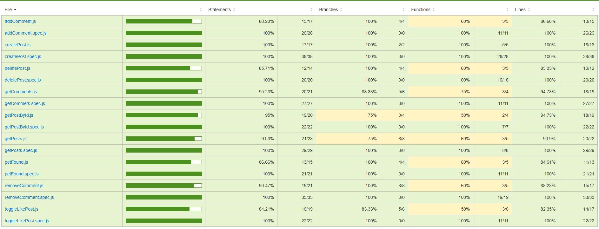
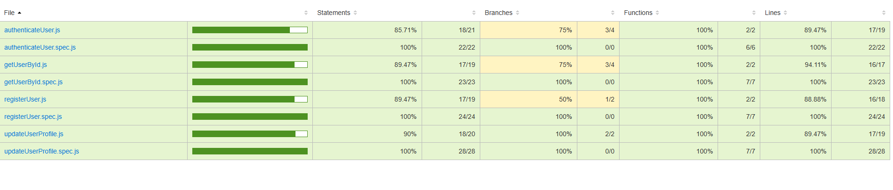
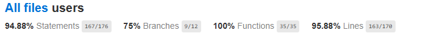

# [PetLocator]

## Intro

An application designed to help people find their lost pets or report pets they have seen lost.

## Functional

### Use Cases

 Regular (User)
- register
- create ad
- view ad (view detailed information and images in a post)
- delete ad
- add comment
- view comments
- remove comment
- like post
- report user(v1)
- report ad(v1)
- report comment
- contact the pet owner or the person who found the animal ( contact the author of the ad for more details via the contact info in the post)
- report a found pet to help reunite it with its owner(es cuando una persona ha encontrado una mascota perdida)
- flag a post when the pet has found its owner (mark a post as "resolved" when the pet is found )

Admin (User)
- view reporting list(posts denunciados)
- view reporting detail
- ban user / ad / comment

### UXUI Design

[Figma](https://www.figma.com/proto/SdVTeLToZLgnrZbtUUohRJ/PetLocator?node-id=4-3&node-type=canvas&t=MA0wRU9n3uCKroh6-0&scaling=scale-down&content-scaling=fixed&page-id=0%3A1)

## Technical

### Blocks

- App (the client-side application)
- API (the server-side API)
- DB (the database)

### Packages

- doc (the documentation)
- app (the client-side application)
- api (the server-side API)
- dat (the data model and driver)
- com (the common validations, utils, ...)

### Data Model

### User
- id (UUID)
- name (string)
- email (string)
- surname (string)
- password (string)
- city(string)
- postalCode(string)
- phone(string)

 ### Ad
- id (UUID)
- author (User.id)
- images ([string]) 
- text (string)
- date (Date)
- likes ([User.id])
- reported(boolean)(v1)
- found(boolean)
- location(point)
- adress (string)

### Comment 
 - id (UUID)
 - author (User.id)
 - text (string)
 - date (Date) 

 #### Location
- id (UUID)
- address (string)
- location (Point)

#### Point
- type (string)
- coords ([number])

Report(v1)
  - id
 - author (User.id)
  - text (string)
 - date (Date) 
 - item (User.id | Ad.id | Comment.id)
 - type (string, enum: user | ad | comment)/permitir para entender de que es

### Techs

- Frontend: React, HTML, CSS, JavaScript, TailwindCS
- Backend: Node.js + Express Mongoose
- Database: MongoDB
- Authentication: JWT
- Password securitation : Bcrypt
- Testing: Mocha & Chai (for backend logic)
- Map Integration: Leaflet.js

### Test Coverage

### issue:
https://github.com/b00tc4mp/isdi-bootcamp-202409/issues/258

